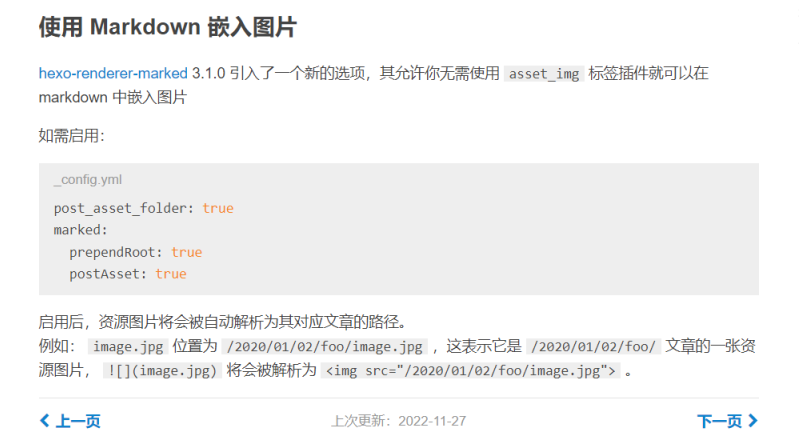
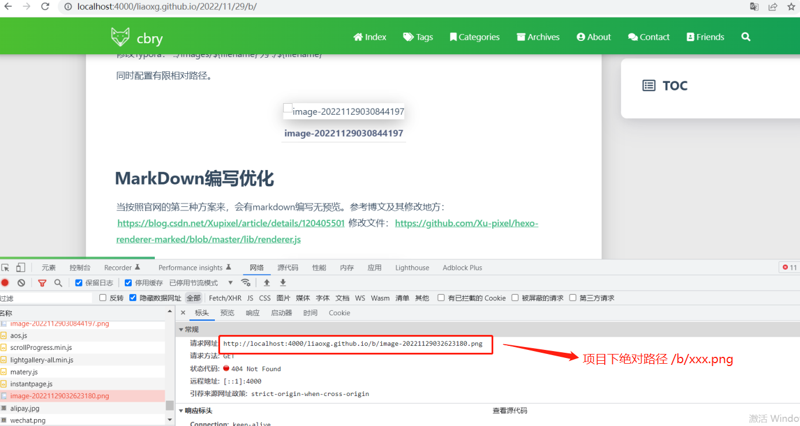
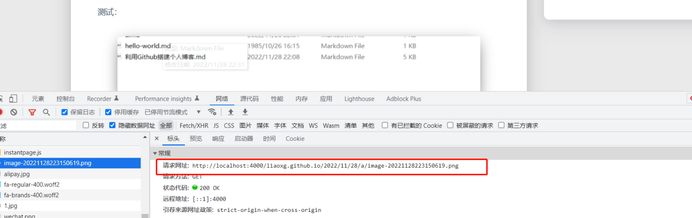
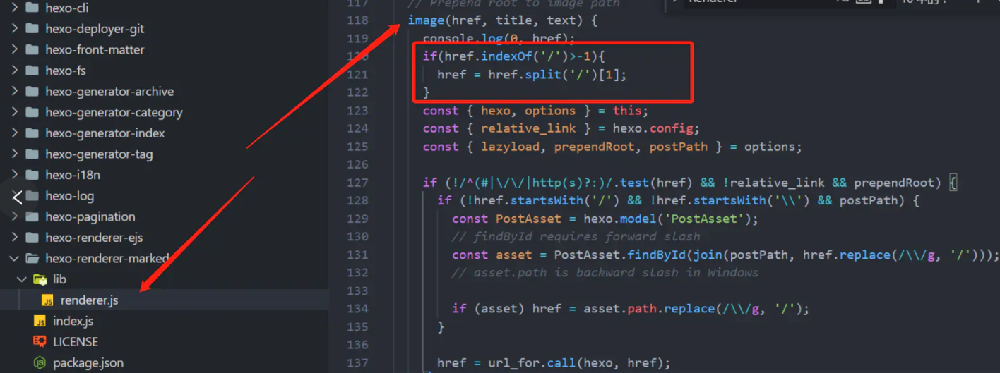
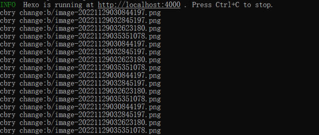

修改Typora：   ../images/${filename}   为 ./${filename}

同时配置有限相对路径。





# MarkDown编写优化

当按照官网的第三种方案来，会有markdown编写无预览。参考博文及其修改地方：https://blog.csdn.net/Xupixel/article/details/120405501 修改文件：https://github.com/Xu-pixel/hexo-renderer-marked/blob/master/lib/renderer.js


分析可以看出image部分函数代码，如果是/ \ 开头的直接解析为了绝对路径，对应现象：

文件路径：

> /b/xxx.png




文件路径（官方第三种解决方案）：

> xx.png





修改：


```js

// Prepend root to image path
  image(href, title, text) {
    const { hexo, options } = this;
    const { relative_link } = hexo.config;
    const { lazyload, prependRoot, postPath } = options;

    if (!/^(#|\/\/|http(s)?:)/.test(href) && !relative_link && prependRoot) {
      if (!href.startsWith('/') && !href.startsWith('\\') && postPath) {
        const PostAsset = hexo.model('PostAsset');
        // findById requires forward slash
        const asset = PostAsset.findById(join(postPath, href.replace(/\\/g, '/')));
        // asset.path is backward slash in Windows
        if (asset) href = asset.path.replace(/\\/g, '/');
      }else if(href.startsWith('/')){
      	
      }
      href = url_for.call(hexo, href);
    }
    /**
     * 以下为Xu-pixel添加，解决markdown编辑器和渲染结果路径不同而导致的写作体验不佳问题
     */
    let hrefSplitList = href.split('/')
    hrefSplitList.shift()
    hrefSplitList.shift()
    hrefSplitList.unshift('.')
    href = hrefSplitList.join('/')
    //以上为Xu-pixel添加

    let out = `';
    return out;
  }
}
```

# 实测不行

代码有问题：

官方解决方案变成：

http://localhost:4000/liaoxg.github.io/2022/11/28/%E5%88%A9%E7%94%A8Github%E6%90%AD%E5%BB%BA%E4%B8%AA%E4%BA%BA%E5%8D%9A%E5%AE%A2/2022/11/28/%E5%88%A9%E7%94%A8Github%E6%90%AD%E5%BB%BA%E4%B8%AA%E4%BA%BA%E5%8D%9A%E5%AE%A2/image-20221128210412527.png

markdown自动变成：http://localhost:4000/liaoxg.github.io/2022/11/28/b/b/xxx.png


# 最新修改方案

https://www.jianshu.com/p/bbbcbb7c4911




```
// Prepend root to image path
  image(href, title, text) {
	  console.log('cbry change:' + href);
	  //cbry添加
	  if(href.indexOf('/')>-1){
		  href = href.split('/')[1];
	  }
	  //cbry添加
	  
```

这样就在官方解决方案适配  xx.png ， 又适配 name/xx.png了完美。


修改组件路径：node_modules\hexo-renderer-marked\lib

插件打印日志：



# 部署提交

hexo clean && hexo g && hexo d --message  "追加cbry自行适配的Typora组件代码版本"