# 建立Git远程仓库

固定格式为：name.github.io

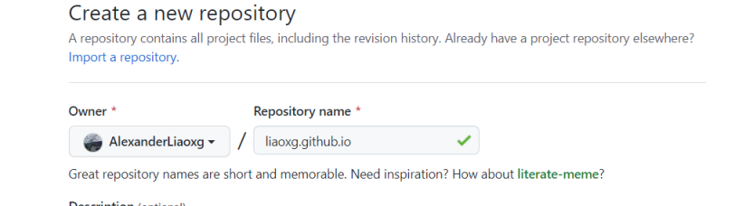

# 开启Github Pages

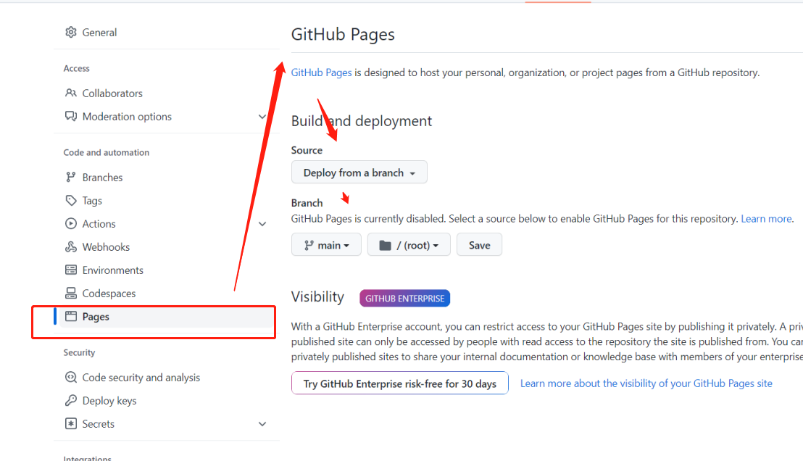


# 设置github的token登陆

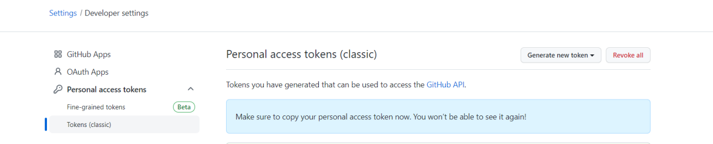

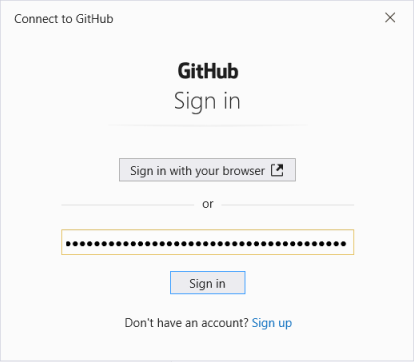

连接不上？：

```
$ git push -u origin master
fatal: unable to access 'xxx': Failed to connect to github.com port 443: Timed out

```

git config --unset https.proxy 试试

# 设置主分支

```
git branch -M main

git push -u origin main
```


# 安装Hexo

在npm环境下：`npm install hexo-cli -g`安装Hexo插件。检查版本号：hexo -v

```
D:\>cd D:\OpenSourceProject\myblog

D:\OpenSourceProject\myblog>npm install hexo-cli -g
```

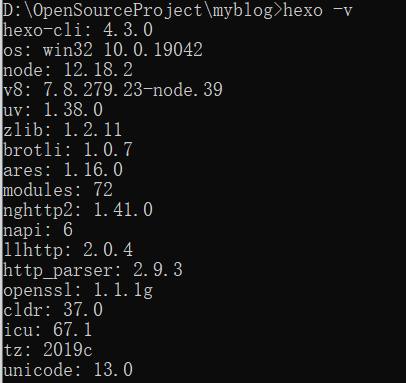

在`博客项目目录`下输入hexo init blog 初始化博客项目生成存储博客的文件夹blog文件夹

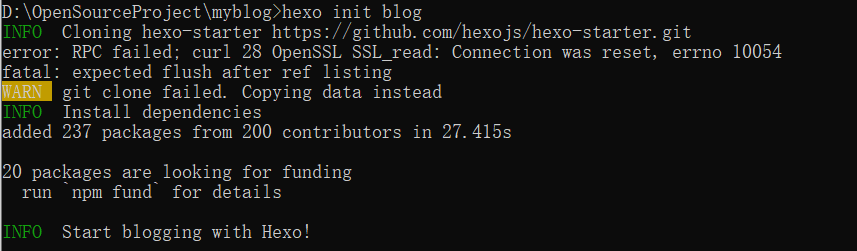

在blog目录下进行安装：npm install ：

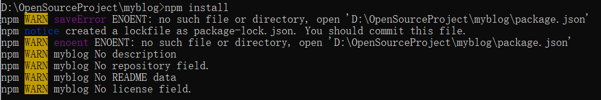

生成如下package-lock.json：

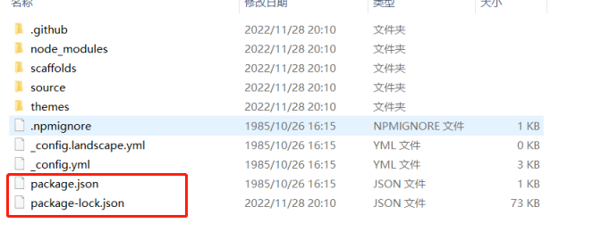

# 使用

在`blog目录下`输入`hexo g`生成静态网页，然后输入`hexo s`打开本地服务器来预览网页

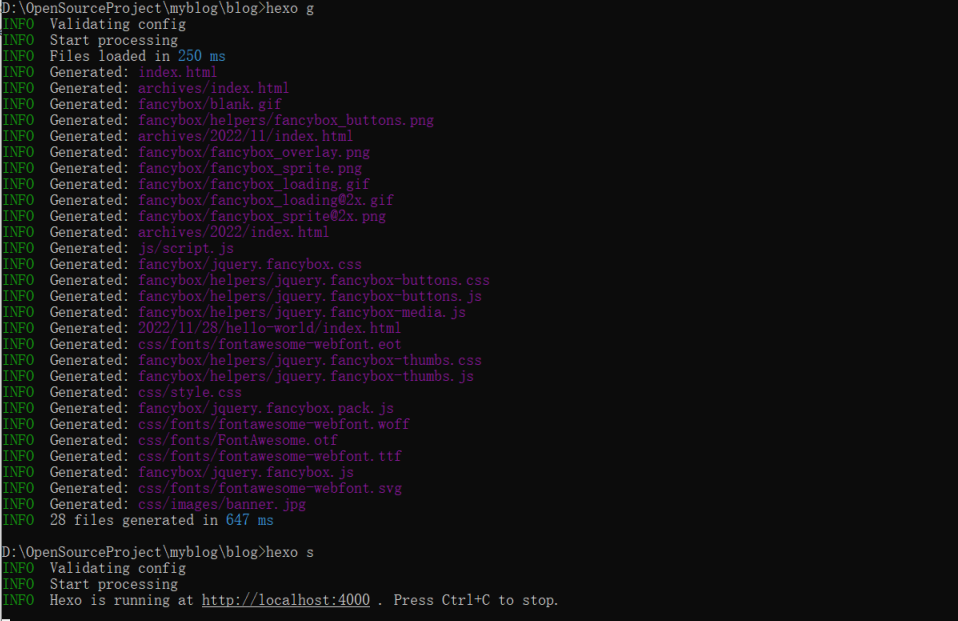

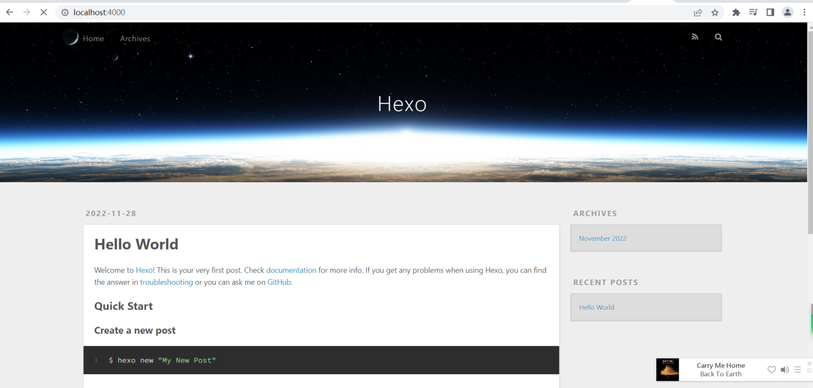

# 修改配置信息

```
title: # 标题
subtitle: # 副标题
description: # 站点描述
keywords: # 搜索关键词
author: # 作者
language: zh-Hans # 语言
timezone: # 时区
```

# 修改主题

https://hexo.io/zh-cn/

https://github.com/blinkfox/hexo-theme-matery

https://github.com/blinkfox/hexo-theme-matery/blob/develop/README_CN.md

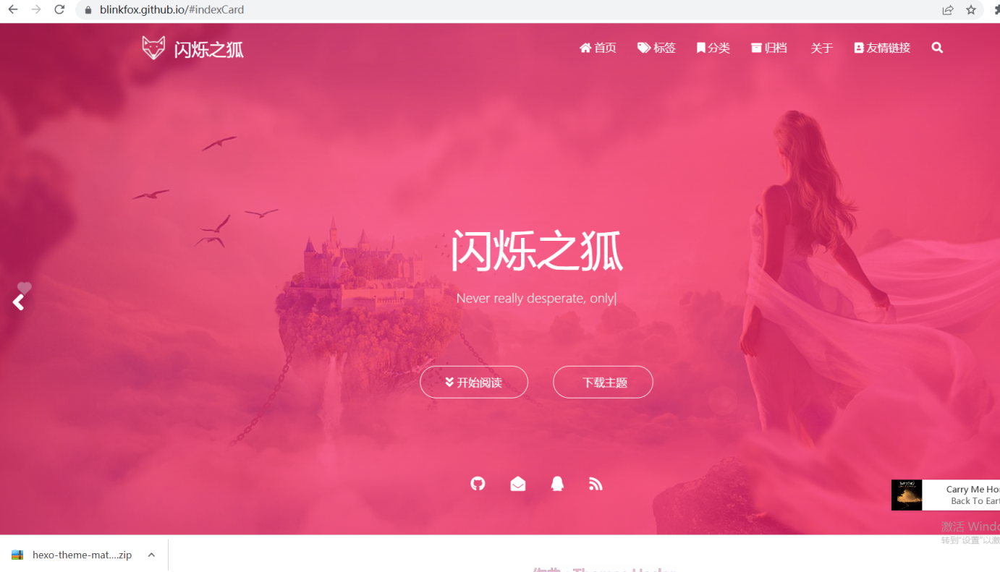

将其解压到你的HEXO下的Themes目录下即可（这里可以看到默认的landscape）：

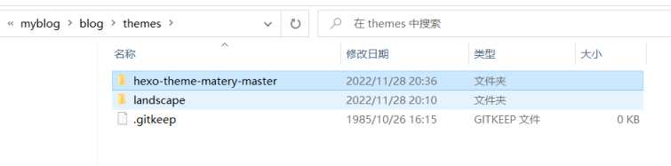

> ### 切换主题
>
> 修改 Hexo 根目录下的 `_config.yml` 的 `theme` 的值：`theme: hexo-theme-matery-master`
>
> #### `_config.yml` 文件的其它修改建议:
>
> - 请修改 `_config.yml` 的 `url` 的值为你的网站主 `URL`（如：`http://xxx.github.io`）。
> - 建议修改两个 `per_page` 的分页条数值为 `6` 的倍数，如：`12`、`18` 等，这样文章列表在各个屏幕下都能较好的显示。
> - 如果你是中文用户，则建议修改 `language` 的值为 `zh-CN`。

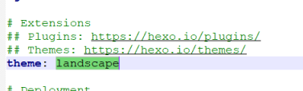

略


# 发表博文文章标头

> title: 利用Github搭建个人博客
> date: 2022-11-28 20:55:30
> tags:[blogs]
> categories:Hexo


```
# 开启服务
hexo server

# 新建文章
hexo new a

# 新建草稿
hexo new draft b

# 发布草稿成为文章
hexo publish b

# 发布关于
hexo new page c

# 生成静态文章
hexo generate 或者是 hexo g
# 部署文章
hexo deploy 或者是 hexo d
```


# 图片无法加载问题

1、采用：引用：blog\source\images\a ， 文件在：D:\OpenSourceProject\myblog\blog\source\_posts\a.md

2、


使用hexo生成静态资源后,由于url的问题会出现图片加载的问题,现在网上的文章及官方的解决方案大概分为三种:

1. 将图片放入source/images目录下,每次generate都会生成图片,在使用相对或绝对路径进行引用
2. npm install https://github.com/CodeFalling/hexo-asset-image --save  , 配置hexo的_config.yml文件, 将 post_asset_folder 设置为true, 这样每次new 生成一个文章时都会同步生成一个同名的文件夹,然后设置相对或绝对路径.
3. 使用hexo官方的解决方案,使用模版变量, 